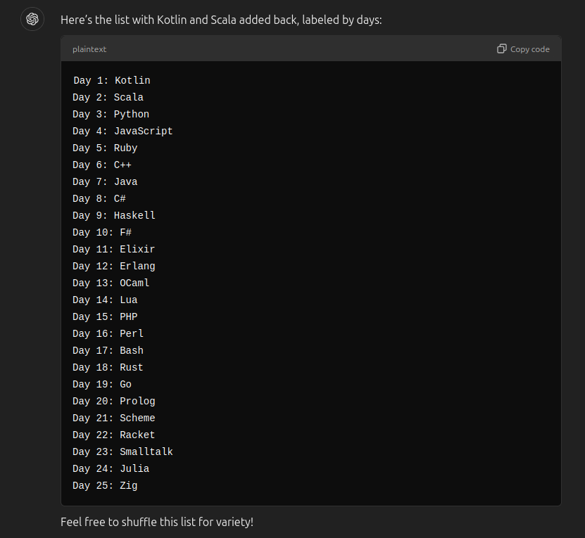

# aoc-2024 but it's silly

Welcome to the Advent of Code[^aoc] Kotlin project created by [otcathatsya][github] using
the [Advent of Code Kotlin Template][template] delivered by JetBrains.

In this repository, otcathatsya is about to provide solutions for the puzzles using [Kotlin][kotlin] language - but
wait!
It's not just Kotlin!! To spice it up, each day will be a different language. As decided by the gods:
 (okay I did Kotlin and Scala before I decided to do this)

Some days will have another Kotlin solution as a reference, for days when I am too lazy or busy to start with a random
language.

[^aoc]:
[Advent of Code][aoc] – An annual event of Christmas-oriented programming challenges started December 2015.
Every year since then, beginning on the first day of December, a programming puzzle is published every day for
twenty-five days.
You can solve the puzzle and provide an answer using the language of your choice.

[aoc]: https://adventofcode.com

[docs]: https://kotlinlang.org/docs/home.html

[github]: https://github.com/otcathatsya

[issues]: https://github.com/kotlin-hands-on/advent-of-code-kotlin-template/issues

[kotlin]: https://kotlinlang.org

[slack]: https://surveys.jetbrains.com/s3/kotlin-slack-sign-up

[template]: https://github.com/kotlin-hands-on/advent-of-code-kotlin-template
